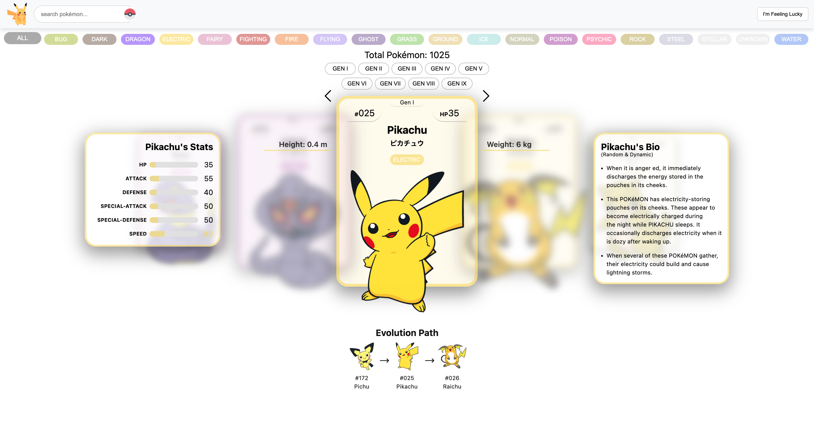
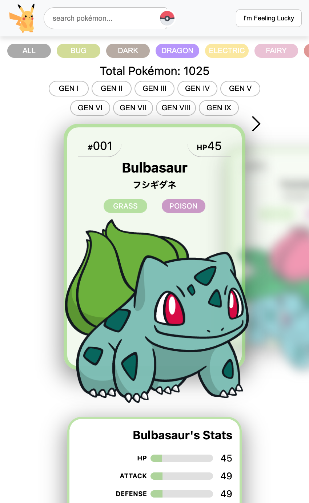
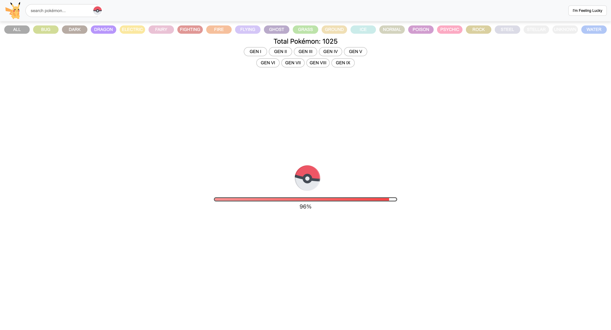
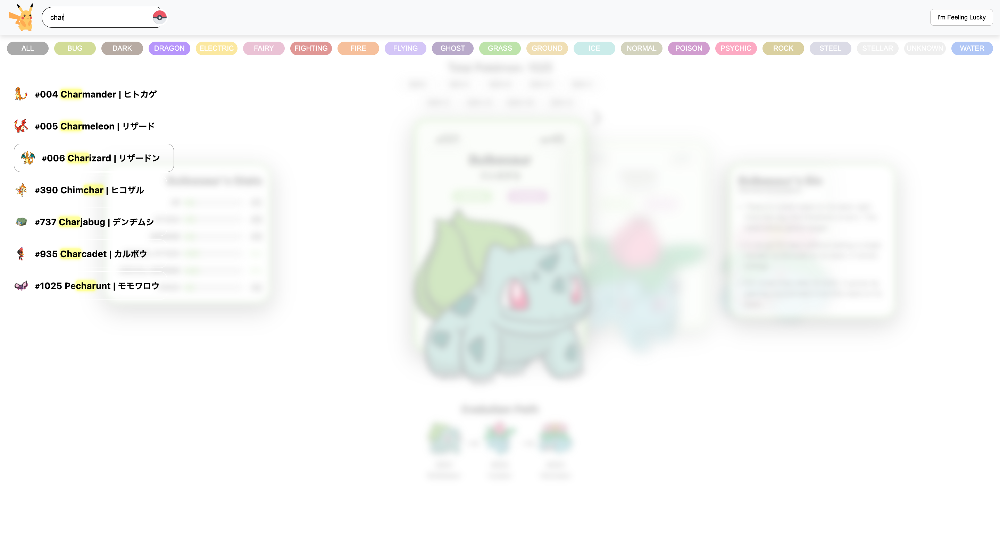
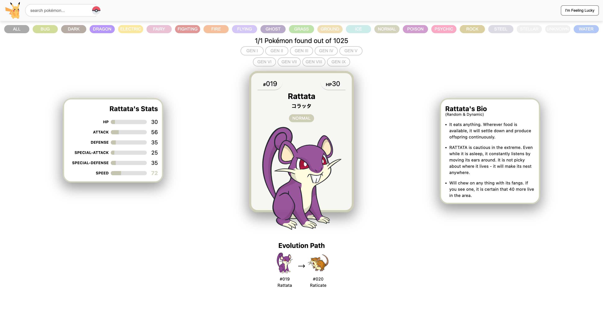

# Pokémon Card Carousel

## TL;DR
An interactive Pokémon card carousel built with React, designed as both a technical showcase and a UI/UX experiment, emphasizing animation, performance, and user experience.



---

## Overview
The [Pokémon Card Carousel](https://pokemoncardcarousel.netlify.app) allows users to browse Pokémon through a horizontally animated slider. Each card reacts to user interaction, revealing additional details and transitions as it becomes active.

The experience is designed to feel dynamic and responsive while remaining readable and performant, even with a large dataset. Rather than using a traditional list or grid layout, Pokémon are presented as collectible-style cards with motion and depth.

All Pokémon data is sourced from the public **[PokéAPI](https://pokeapi.co/)** and enhanced with custom logic for presentation and interaction.

---

## Why I Built This
I built this project out of a personal interest in Pokémon and a desire to experiment with fetching and handling large amounts of data from a free public API.

Rather than presenting Pokémon data in a traditional list or table, I wanted to explore how motion, interaction, and layout could make the information feel more intuitive and engaging. The goal was to create an experience that feels closer to browsing collectible cards than reading raw data, while still remaining informative and usable.

This project also allowed me to deepen my understanding of:
- Asynchronous data fetching at scale  
- Managing loading states and partial failures  
- Component-driven UI design  
- Performance considerations in React applications  

---

## Features

### Animated Card Carousel
- Smooth horizontal navigation with keyboard, mouse, and touch support  
- Depth, scale, and blur effects to emphasize the active card  

### Active Card Details
- Height and weight display  
- Animated stats component  
- Pokémon description  
- Evolution chain with clickable navigation  

### Interactive UI Effects
- Subtle motion and timed reveals when a card becomes active  
- 3D tilt interactions on select components  
- Visual polish inspired by physical trading cards  

### Filtering and Search
- Filter Pokémon by type  
- Search by name (English or Japanese) or number  
- Generation-based navigation  
- “Feeling Lucky” button to discover new Pokémon  

### Loading Experience
- Global loading spinner  
- Loading progress indicator while fetching data  

### Responsiveness
- Responsive layout for desktop and mobile  

---

## Performance Considerations
- Virtualized rendering (only nearby cards are rendered)  
- Image preloading with load-state tracking  
- Memoization to avoid unnecessary re-renders  
- Animations limited to the active card to reduce render overhead  

---

## Technology Stack

### Frontend
- React  
- CSS (custom animations and transitions)  

### Data
- PokéAPI (external data source)  
- Local Japanese name dataset (JSON)  

### Utilities
- Axios for API requests  
- Custom helpers for name normalization, type colors, and UI logic  

---

## Data Sources

### Pokémon Data
All Pokémon data is fetched from the free **[PokéAPI](https://pokeapi.co/)**, including:
- Stats  
- Types  
- Moves  
- Evolution chains  
- Metadata  

### Images
Pokémon images are sourced from official Pokémon sprite repositories:

- **[Dream World SVG sprites](https://github.com/PokeAPI/sprites/tree/master/sprites/pokemon/other/dream-world)**
- **[Official artwork PNGs](https://github.com/PokeAPI/sprites/tree/master/sprites/pokemon/other/official-artwork)** (Fallback Option)  

Images are preloaded to ensure smooth transitions within the carousel.

---

## Project Structure (High Level)

### Carousel
- Handles data fetching, filtering, loading state, and global progress tracking  

### AnimatedSlider
- Manages card layout, positioning, animations, active state, and user interaction  

### Components
- Stats  
- Description  
- Evolution Path  
- UI elements (loading spinner, type button bar, generation bar)  

### Utils
- Name normalization  
- Type color mapping  
- Pokémon metadata helpers  

---

## Screenshots

### Mobile View
<div align="center">
  
</div>

### Loading Screen
<div align="center">
  
</div>

### Search Feature
<div align="center">
  
</div>

### I'm Feeling Lucky
<div align="center">
  
</div>

---

## Setup and Installation

Clone the repository:

```bash
git clone https://github.com/adameasom/pokemon-cards.git
```

Install dependencies:

```bash
npm install
```

Run the development server:

```bash
npm start
```

Open the app at:

`http://localhost:5173`

---

## Design Goals

- Prioritize clarity over clutter
- Use animation to support understanding, not distract from it
- Maintain smooth performance despite a large dataset
- Create an interface that feels deliberate, tactile, and polished

---

## Future Considerations

While the app is considered feature-complete for now, possible future enhancements include:

- Offline support or cached data
- Expanded Pokémon metadata views
- Updated Pokémon images for search and evolutions
- Light / dark theme toggle
- Improved accessibility (ARIA roles and reduced motion support)

---

## Acknowledgements

- Pokémon data provided by the [PokéAPI](https://pokeapi.co/)
- Pokémon and related assets are © Nintendo, Game Freak, and The Pokémon Company
