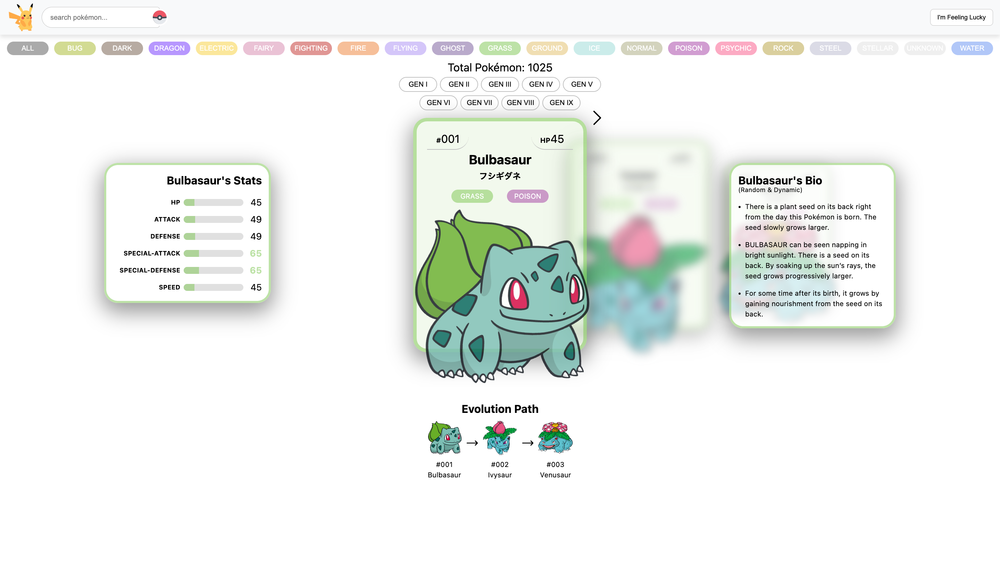
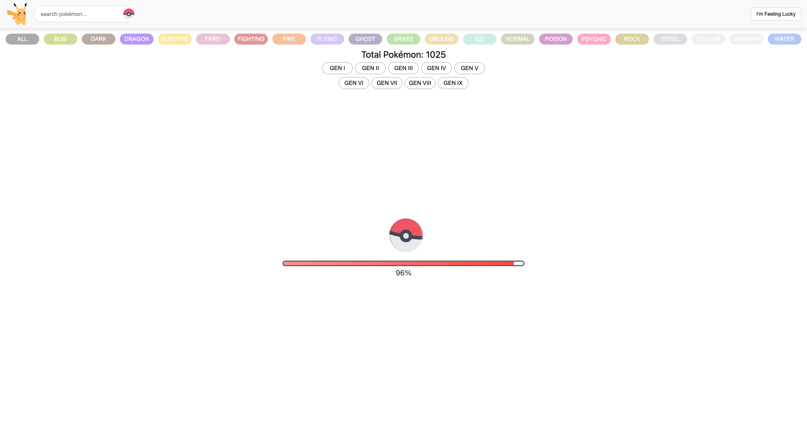
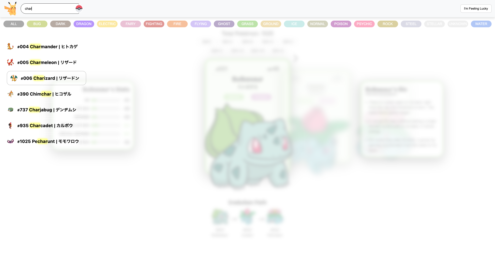
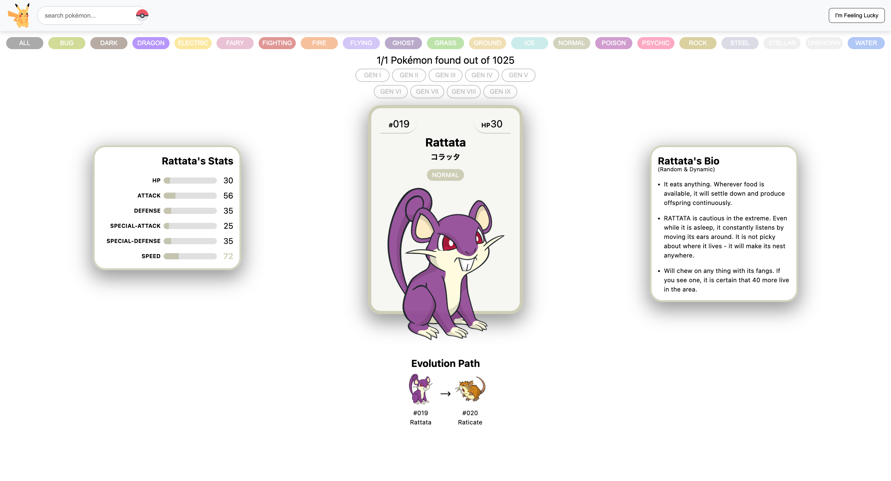
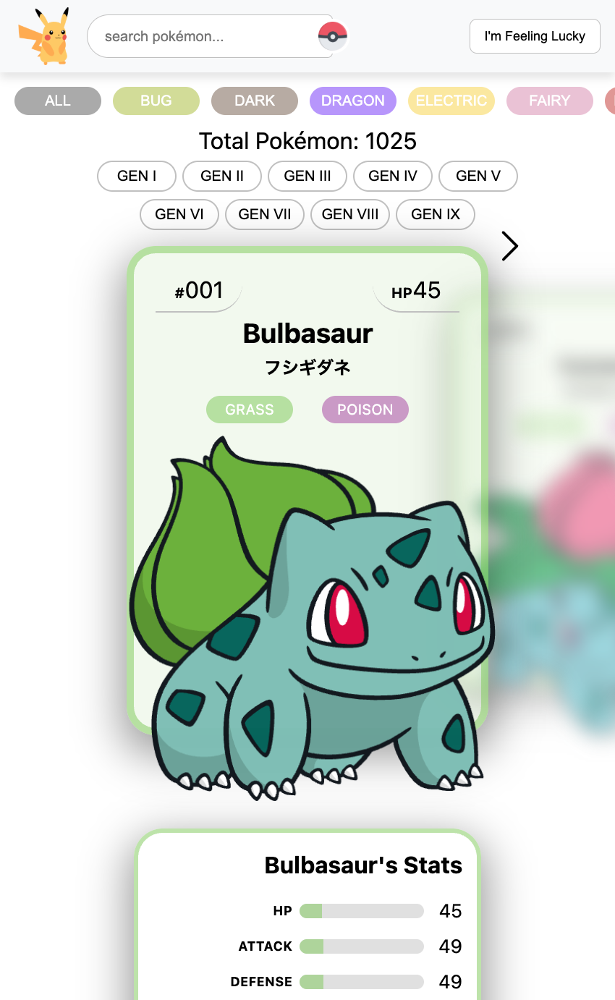

# Pokémon Card Carousel


<p align="center">
  
</p>

A responsive Pokémon card carousel built with **React** that transforms live **[PokéAPI](https://pokeapi.co/)** data into an interactive, collectible-inspired browsing experience through smooth animations, responsive design, and performance-focused rendering.

---

## 🌐 Live Demo

[](https://pokemoncardcarousel.netlify.app)

Optimised for desktop and mobile browsers.

---

## 📋 Table of Contents

- [Overview](#-overview)
- [Project Motivation](#-project-motivation)
- [Key Skills Demonstrated](#-key-skills-demonstrated)
- [Features](#-features)
- [Technologies Used](#-technologies-used)
- [Data Sources](#-data-sources)
- [Performance Considerations](#-performance-considerations)
- [Design Goals](#-design-goals)
- [Development Notes](#-development-notes)
- [Getting Started](#-getting-started)
- [What I Learned](#-what-i-learned)
- [Challenges](#-challenges)
- [Future Improvements](#-future-improvements)
- [Screenshots](#-screenshots)
- [Acknowledgements](#-acknowledgements)
- [Disclaimer](#-disclaimer)
- [License](#-license)

---

## 📌 Overview

Pokémon Card Carousel is an interactive React application that allows users to browse Pokémon through a horizontally animated card carousel powered by live data from the **[PokéAPI](https://pokeapi.co/)**.

Rather than presenting Pokémon in a conventional list or grid, the application recreates the experience of browsing a physical card collection. Animated transitions, depth effects, and contextual information work together to create an engaging interface while maintaining smooth performance across desktop and mobile devices.

The project demonstrates practical frontend development concepts including asynchronous data fetching, component-based architecture, rendering optimisation, responsive design, and user-focused interface development.

---

## 🎯 Project Motivation

I built this project out of a personal interest in Pokémon and a desire to explore working with large datasets from a public API while continuing to develop my React skills.

Rather than displaying Pokémon data in a traditional table or list, I wanted to create an interface that felt enjoyable to interact with. My goal was to combine smooth animations, thoughtful layout, and responsive interactions to capture the feeling of browsing a real trading card collection while maintaining clarity and usability.

This project also gave me the opportunity to deepen my understanding of:

- Asynchronous data fetching at scale
- Managing loading states and partial failures
- Component-driven UI architecture
- Rendering performance and optimisation
- Creating polished, user-focused interfaces

---

## 💪 Key Skills Demonstrated

- React component architecture
- React Hooks (`useState`, `useEffect`, `useMemo`)
- API integration with Axios
- Asynchronous JavaScript
- Rendering optimisation and virtualisation techniques
- Responsive web design
- Search and filtering functionality
- State management
- Custom animations and transitions
- Performance-focused UI development
- User experience (UX) design

---

## ✨ Features

### 🎴 Animated Card Carousel

- Smooth horizontal navigation with keyboard, mouse, and touch support
- Depth, scaling, and blur effects that emphasise the active Pokémon
- Animated transitions designed to replicate the feel of browsing collectible cards

### 📖 Active Card Details

- Pokémon height and weight
- Animated statistics display
- Pokémon descriptions
- Interactive evolution chain with clickable navigation

### ✨ Interactive UI Effects

- Timed content reveals when cards become active
- Subtle 3D tilt interactions on selected components
- Carefully designed transitions to create a tactile browsing experience

### 🔍 Filtering and Search

- Filter Pokémon by type
- Search by English name, Japanese name, or Pokédex number
- Generation-based navigation
- "Feeling Lucky" feature for discovering random Pokémon

### ⏳ Loading Experience

- Global loading spinner
- Progressive loading indicator while Pokémon data is retrieved

### 📱 Responsive Design

- Responsive layout for desktop and mobile devices
- Touch-friendly interactions for smaller screens

---

## 🛠 Technologies Used

### Frontend

- React
- JavaScript (ES6+)
- HTML5
- CSS3 (custom animations and transitions)

### Data & APIs

- PokéAPI
- Local Japanese name dataset (JSON)

### Libraries & Utilities

- Axios
- Custom helper functions for:
  - Name normalisation
  - Type colour mapping
  - UI behaviour
  - Pokémon metadata handling

---

## 🌐 Data Sources

### Pokémon Data
All Pokémon data is fetched from the free public **[PokéAPI](https://pokeapi.co/)**, including:
- Stats  
- Types
- Height and Weight
- Evolution chains  
- Metadata  

The API was chosen because it provides a comprehensive, well-documented dataset that is ideal for experimenting with asynchronous data fetching and dynamic content rendering.

### Images
Pokémon images are sourced from official Pokémon sprite repositories:

- **[Dream World SVG sprites](https://github.com/PokeAPI/sprites/tree/master/sprites/pokemon/other/dream-world)**
- **[Official artwork PNGs](https://github.com/PokeAPI/sprites/tree/master/sprites/pokemon/other/official-artwork)** (Fallback Option)  

Images are preloaded to create smoother transitions throughout the carousel and reduce visible loading during navigation.

### Local Data

A local JSON dataset is used to provide Japanese Pokémon names, allowing users to search using either English or Japanese names while keeping the search experience fast and responsive.

---

## ⚡ Performance Considerations

Although the application presents a large amount of Pokémon data, several techniques were used to maintain a smooth and responsive experience.

### Windowed Rendering

Rather than rendering every Pokémon card simultaneously, the carousel only renders the active card and nearby cards. This significantly reduces the number of DOM elements and improves rendering performance.

### Image Loading Strategy

Images are preloaded before being displayed, reducing flickering during navigation. If a Dream World SVG is unavailable, the application automatically falls back to the official artwork image.

### Memoisation

React memoisation techniques are used where appropriate to minimise unnecessary re-renders and improve overall responsiveness.

### Animation Optimisation

Animations are intentionally limited to active elements. Cards outside the active viewing area remain lightweight, helping maintain smooth transitions even while browsing large datasets.

---

## 🎨 Design Goals

The primary goal of this project was to create an interface that feels enjoyable to explore rather than simply displaying information.

The design focused on several key principles:

- Prioritise clarity over clutter.
- Use animation to support navigation rather than distract from it.
- Create an experience that feels closer to browsing physical trading cards.
- Maintain smooth performance while displaying a large dataset.
- Keep the interface responsive across desktop and mobile devices.
- Balance visual polish with usability.

Every animation, transition, and layout decision was intended to improve the browsing experience without overwhelming the user.

---

## 📝 Development Notes

Several implementation decisions helped shape the final application.

- PokéAPI does not provide a single endpoint containing all required Pokémon information, so data is fetched across multiple API endpoints and combined before rendering.
- Carousel rendering is windowed to reduce unnecessary DOM updates.
- Image loading uses a fallback strategy (Dream World → Official Artwork) to improve reliability.
- Animations are limited to active components to minimise rendering overhead.
- Utility functions are separated from UI components to keep the codebase organised and easier to maintain.

These decisions were made to improve maintainability while keeping the application performant and responsive.

---

## 🚀 Getting Started

### Clone the repository

```bash
git clone https://github.com/adameasom/pokemon-cards.git
```

### Navigate to the project directory

```bash
cd pokemon-cards
```

### Install dependencies

```bash
npm install
```

### Start the development server

```bash
npm run dev
```

The application will be available at:

```text
http://localhost:5173
```

---

## 📚 What I Learned

This project gave me valuable experience working with larger datasets and designing user interfaces that balance visual appeal with performance.

Throughout development, I strengthened my understanding of:

- Working with multiple asynchronous API requests using Axios
- Managing loading states and handling partial failures gracefully
- Structuring reusable React components for maintainability
- Optimising rendering performance through windowed rendering and memoisation
- Creating responsive layouts that adapt to different screen sizes
- Designing animations that enhance usability rather than distract from it
- Organising a growing React project into reusable, maintainable modules

Perhaps most importantly, I learned that creating a polished user experience often involves many small design and technical decisions rather than one large feature.

---

## 🧩 Challenges

One of the biggest challenges was coordinating data from multiple PokéAPI endpoints while maintaining a responsive user experience.

Because Pokémon information is distributed across several API resources, I needed to combine data from multiple requests before presenting it in a way that felt seamless to the user.

Another challenge was balancing visual polish with application performance. Since the project displays a large number of Pokémon, rendering every card simultaneously would have created unnecessary overhead. To address this, I explored techniques such as windowed rendering, image preloading, and limiting animations to active components.

Designing an interface that remained engaging while avoiding excessive visual noise was also an important consideration throughout development.

---

## 🔮 Future Improvements

Although the application is considered feature-complete for its current scope, there are several enhancements I would consider in future versions:

- Offline support through cached API responses
- Expanded Pokémon metadata views
- Updated Pokémon images for search and evolutions
- Additional sorting and filtering options
- Light and dark theme support
- Improved accessibility, including ARIA attributes and reduced-motion support
- Keyboard shortcuts for faster navigation
- Additional performance optimisations for lower-powered devices

---

## 📷 Screenshots

### Desktop

<p align="center">
  
</p>

---

### Loading Screen

<p align="center">
  
</p>

---

### Filtering and Search

<p align="center">
  
</p>

---

### Feeling Lucky

<p align="center">
  
</p>

---

### Mobile View

<p align="center">
  
</p>

---

## 🙏 Acknowledgements

This project would not have been possible without the excellent free resources provided by the community.

- Pokémon data provided by the [PokéAPI](https://pokeapi.co/)
- Thanks to the PokéAPI maintainers for creating and maintaining a comprehensive public API
- Pokémon artwork provided by official Pokémon sprite repositories
- Design inspiration drawn from physical Pokémon Trading Card Game collections and collectible-style user interfaces

---

## ⚠️ Disclaimer

This project was created for educational and portfolio purposes only.

Pokémon and all related names, artwork, trademarks, and intellectual property are owned by Nintendo, Game Freak, and The Pokémon Company.

No copyright infringement is intended, and no commercial use is made of Pokémon assets within this project.

---

## 📄 License

This project is licensed under the MIT License.

See the [LICENSE](LICENSE) file for more information.